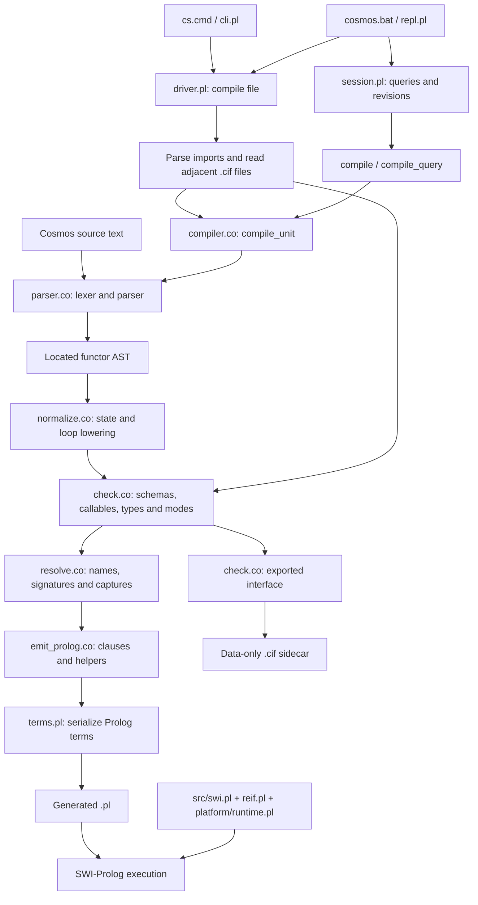
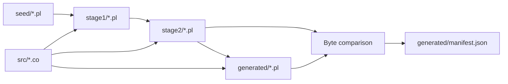

# Compiler project map and review

Reviewed 2026-09-18. Scope: the active native compiler, shared compilation/session machinery, SWI runtime, command-line entry points, build, and compiler tests. Canvas, the HTML editor, rendering, and browser integration are excluded. No implementation changes were made for this review.

## Orientation

Cosmos is a self-hosted source-to-source compiler: six Cosmos (`.co`) modules produce SWI-Prolog (`.pl`). Node orchestrates the bootstrap and tests; it is not the compiler implementation. Checked-in generated Prolog allows compilation without a self-build. The checked-in Prolog seed is the bootstrap trust root.

The six source modules total 3,584 lines. There is no separate active lexer file: lexical analysis is part of `parser.co`.

## Compilation map

The actual orchestration order is **parse → normalize → check → resolve → emit**. Checking also calls the resolver for built-in functor names. The emitter receives the resolver API for scope/capture work, so the dependencies are not strictly linear.

## Source ownership

| File | Lines | Responsibility / useful entry points |
|---|---:|---|
| `src/compiler.co` | 40 | Public API: `compile`, `compile_unit`, `imports`, `compile_query`; assembles passes and returns code plus interface. |
| `src/parser.co` | 1,267 | Indentation-aware lexer, tokens, expression precedence, declarations and goals; `lex`, `parse`, `parseTokens`; AST nodes carry `Loc(line,column)`. |
| `src/normalize.co` | 486 | Rewrites explicit state into logical variable versions; branch joins, state parameters, temporal `init`/`next`, and loop transformations; `normalize`. |
| `src/check.co` | 855 | Nominal schemas, protocols, callable contracts, imported metadata, conservative type/mode flow, call validation, and exported interfaces; `analyze`, `interface`. |
| `src/resolve.co` | 193 | Partitions relations/top-level goals, collects globals, merges clause signatures and computes transitive captures to a fixed point; `analyze`, `scopeVariables`, `captures`. |
| `src/emit_prolog.co` | 743 | Generates clauses, closure wrappers, runtime contracts, control flow, module-prefixed predicates, and exported entry; `generate`. |

Paths in this table are relative to `compiler/`. These are the primary files to edit for language changes; `generated/` is output.

## Platform and runtime map

| Location | Role |
|---|---|
| `compiler/platform/driver.pl` | Loads compiler/runtime, compiles files, reads `.cif` metadata, reports diagnostics, adds optional `main/1` adapter, saves standalone executables. |
| `compiler/platform/cli.pl` | File compilation entry point; uses the active `generated/` tree independently of the caller's working directory. |
| `compiler/platform/build.pl` | Compiles one compiler source using a selected bootstrap stage. |
| `compiler/platform/run.pl` | Loads a generated file, adds its directory to library search, and executes its exported entry. |
| `compiler/platform/repl.pl` | Interactive interpreter, compile/run switches, file-scoped queries, tracing and debug contracts. |
| `compiler/platform/session.pl` | Revision-scoped compilation, ordered query results, entry invocation and predicate disposal. Shared native functionality; reviewed independently of any UI. |
| `compiler/platform/terms.pl` | Term construction/inspection, compiler cells, clause serialization, query-text validation and export insertion. |
| `compiler/platform/runtime.pl` | Operations used by emitted code: object access, contracts, callable execution, tracing and generic host boundary. Host implementation is outside this review. |
| `compiler/platform/codec.pl` | Tagged values and query outcomes; retains shared variable identities, distinguishes strings from lists. |
| `compiler/platform/swi-result.mjs` | JavaScript decoding of those tagged results. |
| `src/swi.pl` | Base language operations, arithmetic/iteration, closures, module loading and cached standard libraries. |
| `src/reif.pl` | Reification support loaded by `swi.pl`. |
| `libs/`, `userlibs/` | Runtime library search roots. Individual libraries were not exhaustively reviewed. |

Generated programs use predicate names prefixed with the module identifier, rather than isolated SWI modules. Their exported entry is a predicate named after that identifier with one output argument. This makes namespace ownership and session cleanup important.

`compile_unit` returns `{prolog, interface}`. File compilation writes `.pl` and `.cif`. Interfaces are parsed as data and checked for format/shape; imported code is not executed to obtain them. Missing sidecars are omitted, so unavailable metadata reduces static checking. Sidecar lookup is adjacent to the input source; runtime library lookup follows its own search path. Dependencies are not recursively compiled.

`compile_query` appends an ordered `export([...])` and returns module, entry, variables, source and Prolog. Query/session compilation uses `compile`, not the file driver's interface-loading path.

## Bootstrap and repository boundaries

`compiler/build.mjs` invokes a fresh SWI process for each of six modules at each stage, compares stage 2 and generated `.pl` files, then records SHA-256 hashes. The comparison does not include `.cif` files. The manifest covers 23 source/seed/generated/runtime files, not every platform adapter or interface.

The build also unconditionally writes a browser asset bundle. That is an external build dependency, not a reviewed browser component. The full build was not run during this review to avoid changing excluded Canvas assets.

| Repository area | How to treat it |
|---|---|
| `compiler/src`, `compiler/platform`, root `src/swi.pl` and `src/reif.pl` | Active implementation. |
| `compiler/seed`, `compiler/generated` | Bootstrap input and runnable generated artifacts. |
| `tests/compiler` | Current compiler regression suite and executable-guide checks. |
| `compiler/GUIDE.md` | Current user-facing language guide. |
| `src/docs/compiler-*.md` | Additional architecture/bootstrap/type documentation; some relative links are stale. |
| `legacy/lua-compiler` | Retired implementation; not required by the active pipeline. |
| `comp/`, versioned snapshots, root archives, older test trees | Historical/experimental material; not selected by the active build. |
| `cs-installer/payload/` | Distribution copies; not authoritative compiler source. Installer behavior was not audited. |
| Canvas and HTML editor | Excluded. |

## Review findings

### P2 — Session disposal can remove another session's predicates

At `compiler/platform/session.pl:60`, disposal matches every predicate whose name starts with the supplied prefix. Both `cosmos_review` and `cosmos_review_other` are accepted session identifiers. Disposing the first also abolishes predicates owned by the second. Uniqueness alone does not prevent this collision.

Reproduced in a fresh native SWI process by asserting `cosmos_review/1` and `cosmos_review_other/1`, calling `compiler_session_dispose(cosmos_review)`, and checking the latter. Result: `other_session_deleted`.

Recommended fix: match the exact entry name or the prefix followed by the emitter's `::` namespace delimiter; alternatively record the exact predicates owned by each revision. Add a regression with overlapping session names.

### P3 — Compiler README links point to an absent documentation directory

`compiler/README.md` links to `../docs/compiler-bootstrap.md`, `../docs/compiler-v2-types.md`, and `../docs/compiler-v2.md`, but these files are under `src/docs/`. Readers following the advertised architecture and support-limit links cannot reach them. Point these links to their actual locations or consolidate around `GUIDE.md` and this map.

### Build observations worth addressing

- The build publishes directly into `generated/` before checking stabilization. An interrupted or failed build can leave mixed generations. Build and verify in a staging directory, then publish the artifact set.
- Compiler-only build/test commands are coupled to browser assets and WASM tests. Separate native verification from integration checks to make the compiler boundary explicit.
- `.pl` and `.cif` are written sequentially, without atomic publication as a pair. Compile-time semantic errors occur before writing, but later I/O failures can still leave mismatched artifacts.

These are code-inspection observations; failure injection was not performed.

## Validation and limits

- All 23 hashes recorded in the checked-in manifest match the current files. This establishes consistency with that manifest, not a newly verified bootstrap fixed point.
- The session-cleanup collision was reproduced directly in native SWI-Prolog.
- The compiler suite and executable-guide check passed: 28 tests, zero failures (about 105 seconds). The requested name filter did not exclude the two bundled SWI-WASM/Canvas checks: both ran and passed incidentally. Their implementation remains outside this review. The run also printed `Unknown message: codec_failure` despite passing; this diagnostic was not investigated.
- No browser/editor behavior, full installer, archive, performance benchmark, or exhaustive language-correctness audit is claimed.
- The current guide explicitly limits whole-program inference, static determinism proofs, recursive dependency compilation, general constructive negation/control exits, and asynchronous scheduling.

## Where to start for changes

| Change | Start here |
|---|---|
| Syntax or diagnostics | `parser.co`, then downstream AST consumers |
| State or temporal-loop semantics | `normalize.co`, then emitter and runtime operations |
| Types, modes, protocols, imported API checks | `check.co` and `.cif` handling in `driver.pl` |
| Closure captures or multi-clause scope | `resolve.co`, then `emit_prolog.co` |
| Generated execution behavior | `emit_prolog.co`, `platform/runtime.pl`, `src/swi.pl` |
| CLI, executable launch or file lookup | `cli.pl`, `repl.pl`, `driver.pl`, root launchers |
| Query values or session lifetime | `session.pl`, `terms.pl`, `codec.pl`, `swi-result.mjs` |
| Bootstrap reproducibility | `build.mjs`, `platform/build.pl`, seed and manifest |

Preserve generic behavior throughout: no program-name or distinctive-source special cases, and no per-program fallback implementation.
